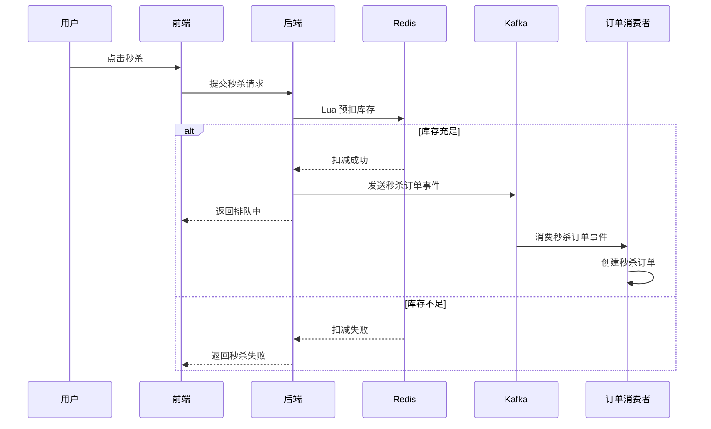

# Shiwei Backend

高并发商城后端项目，围绕 **订单流转、秒杀库存、缓存一致性、异步解耦、稳定性治理** 进行设计与实现。

> 🔗 **配套前端仓库**：[Shiwei_fe](https://github.com/liang396/Shiwei_fe) - 完整商城前端实现

## 📌 项目速览

- **核心问题**：库存扣减防超卖、订单状态流转一致性、重复消息消费、缓存击穿与超时取消
- **核心方案**：Redis + Lua、状态机 + 状态专属 CAS、Outbox + Kafka、Redisson 延迟队列、Sentinel 限流降级
- **代码亮点**：订单状态机、双游标分页、消费幂等、死信机制、敏感信息 AES 加密、雪花 ID 时钟回拨保护
- **工程化能力**：Actuator / Micrometer 指标、Hibernate Validator 参数校验、分钟级防刷、二级缓存一致性
---

## 项目定位

这个项目不是简单的接口堆砌，而是从真实电商交易系统里最常见的几个难点切入：

- 订单状态如何避免并发错乱
- 秒杀库存如何避免超卖
- 热点数据如何做缓存和削峰
- 异步链路如何保证最终一致性
- 高峰流量下如何限流与降级

---

## 技术栈

- Java 21
- Spring Boot 3.3.13
- MyBatis-Plus
- MySQL 8
- Redis
- Redisson
- Kafka
- Caffeine
- Sentinel
- Actuator / Micrometer
- Hibernate Validator

---

## 🧠 核心流程图（秒杀下单）



---

## 问题 - 方案 - 收益

| 问题 | 方案 | 收益 |
|---|---|---|
| 订单支付、取消、超时并发触发导致状态错乱 | 状态机 + 状态专属 CAS 更新 | 保证订单状态只沿合法路径流转 |
| 重复提交订单 / 重复取消订单 | Redis + Lua 前置防重 | 在入口侧削峰，减少无效请求打到数据库 |
| 普通订单超时关闭依赖扫描不及时 | Redisson 延迟队列 + Redis ZSet 兜底扫描 | 兼顾处理时效性和补偿能力 |
| 异步消息重复消费或投递失败 | Outbox + Kafka + processed 表 + dead letter 表 | 提高异步链路可靠性 |
| 订单列表查询存在 N+1 问题 | 订单明细批量查询 + 内存分组装配 | 降低数据库往返次数 |
| 深分页性能差 | 双字段游标分页（created_at + id） | 查询稳定，适合订单数据持续增长场景 |
| 热点订单查询命中数据库过多 | 本地 Caffeine + Redis 二级缓存 + 失效广播 | 提升命中率并兼顾多实例一致性 |
| 高峰流量下非核心接口挤占资源 | Sentinel 限流 + profile 降级返回 | 优先保障交易主链路 |

---

## 核心模块

### 1. order

负责：

- 订单创建
- 状态流转
- 超时取消
- 分页查询
- 二级缓存
- Outbox 事件落库

### 2. pay

负责：

- 模拟支付页创建
- 模拟支付回调
- 支付流水记录
- 触发 `PAY_SUCCESS` 事件

### 3. seckill

负责：

- 秒杀活动与商品
- Lua 预扣库存
- Kafka 异步创建秒杀订单
- 未支付秒杀单超时回补库存

### 4. promotion

负责：

- 优惠券领取
- 优惠券核销
- 订单取消后返券

### 5. auth / cart / address / profile

负责：

- 登录注册
- 购物车
- 收货地址
- 个人资料

---

## 关键设计点

### 订单状态流转

核心状态包括：

- `PENDING_PAY`
- `PAID`
- `CANCELED`

核心事件包括：

- `PAY_SUCCESS`
- `USER_CANCEL`
- `PAY_TIMEOUT`

状态变更不允许业务代码直接改字段，统一交给状态机处理。

### 秒杀库存一致性

秒杀链路采用：

- Redis 预扣库存
- Lua 原子校验
- 失败回滚 Redis 库存
- 超时未支付订单定时补偿

本次升级后，秒杀一人一单的预判层改为 `sharded Redis Set`：

- 分片规则：`userId % 32`
- Lua 内原子执行：`SISMEMBER + DECRBY + SADD`
- 消费端落库前继续按 `activityId + userId` 做幂等校验
- 超时回滚时同步 `SREM` 用户占位，恢复购买资格

### 秒杀超时补偿

秒杀单创建后并不意味着链路结束。如果用户长时间未支付，系统会通过延迟队列和兜底扫描触发超时关闭，并把此前预扣的秒杀库存补回，避免“库存已经扣减但订单最终失效”的脏状态长期存在。

这部分补偿逻辑的价值在于：

- 保证 Redis 侧库存与订单最终状态一致
- 避免热点活动因为未支付订单堆积而长期少卖
- 让秒杀流既有高并发入口削峰，也有后置纠偏机制

### 异步链路可靠性

使用：

- `t_order_outbox`
- `t_message_processed`
- `t_message_dead_letter`

组成完整的“本地事务 + 投递 + 消费幂等 + 死信兜底”链路。

### 安全治理

包括：

- DTO 参数校验
- 验证码、下单、地址保存分钟级防刷
- 手机号和地址 AES 加密存储
- 返回结果脱敏
- 雪花 ID 时钟回拨保护

---

## 数据库表

订单主链路：

- `t_order`
- `t_order_item`
- `t_order_status_log`
- `t_pay_log`
- `t_order_outbox`
- `t_message_processed`
- `t_message_dead_letter`

秒杀链路：

- `seckill_activity`
- `seckill_goods`
- `seckill_order`

SQL 文件：

- `sql/schema.sql`
- `sql/demo-data.sql`

---

## 快速启动

### 1. 环境准备

- JDK 21
- Maven 3.8+
- MySQL 8
- Redis
- Kafka

### 2. 创建数据库

```sql
CREATE DATABASE shiwei DEFAULT CHARACTER SET utf8mb4;
```

### 3. 导入 SQL

按顺序执行：

1. `sql/schema.sql`
2. `sql/demo-data.sql`

### 4. 本地配置

仓库已提供示例配置文件：

```bash
cp src/main/resources/application.yml.example src/main/resources/application.yml
```

然后根据本地环境修改以下信息：

- MySQL 连接配置
- Redis 连接配置
- Kafka 地址
- JWT 密钥
- 支付沙箱参数

### 5. 启动项目

主启动类：

```text
com.shiwei.seckill.ShiweiSeckillApplication
```

默认端口：

```text
8102
```

---

## API 示例

### 商品分页

```http
GET /product/page?size=6
GET /product/page?lastId=2006&size=6
```

### 新增 / 编辑普通商品

```http
POST /product/admin/save
Content-Type: application/json
```

```json
{
  "productId": 3001,
  "productItemId": 4001,
  "productName": "新品测试商品",
  "productImage": "https://images.unsplash.com/photo-1511707171634-5f897ff02aa9?auto=format&fit=crop&w=900&q=80",
  "productImages": [
    "https://images.unsplash.com/photo-1511707171634-5f897ff02aa9?auto=format&fit=crop&w=900&q=80",
    "https://images.unsplash.com/photo-1541807084-5c52b6b3adef?auto=format&fit=crop&w=900&q=80",
    "https://images.unsplash.com/photo-1523206489230-c012c64b2b48?auto=format&fit=crop&w=900&q=80",
    "https://images.unsplash.com/photo-1484704849700-f032a568e944?auto=format&fit=crop&w=900&q=80",
    "https://images.unsplash.com/photo-1495435229349-e86db7bfa013?auto=format&fit=crop&w=900&q=80"
  ],
  "description": "支持 Apifox 直接新增或编辑的普通商品示例。",
  "category": "电子产品",
  "subcategory": "手机平板",
  "theme": "electronics-phone",
  "price": 1999.00,
  "stock": 50,
  "sales": 0,
  "popularity": 0,
  "featured": true
}
```

说明：

- `productId` 已存在时表示编辑，不存在时表示新增
- `productImages` 建议传 5 张图，商品详情页会直接拿来做缩略图和轮播
- `productImage` 作为封面图；如果不传，会默认取 `productImages[0]`
- `theme` 可复用现有主题，如 `electronics-phone`、`electronics-laptop`、`fresh-fruit`、`fashion-shoe`

### 提交订单

```http
POST /order/submit
Content-Type: application/json
```

```json
{
  "addressId": 1,
  "consignee": "demo",
  "mobile": "13800138000",
  "address": "Shanghai Pudong demo road",
  "couponId": 1,
  "couponTitle": "新人券",
  "goodsAmount": 99,
  "discountAmount": 10,
  "payAmount": 89,
  "items": [
    {
      "productId": 2005,
      "productName": "草莓鲜果礼盒",
      "price": 99,
      "quantity": 1
    }
  ]
}
```

### 秒杀提交

```http
POST /seckill/submit
Content-Type: application/json
```

```json
{
  "activityId": 1,
  "goodsId": 1001
}
```

响应示例：

```json
{
  "code": 200,
  "message": "排队中",
  "data": {
    "orderId": "123456789"
  }
}
```

### 订单分页

```http
GET /order/page?size=6
GET /order/page?lastCreatedTime=2026-06-05%2012:00:00&lastId=12&size=6
```

### 模拟支付回调

```http
POST /pay/mock/notify
```

表单字段：

```text
out_trade_no=订单号
trade_no=MOCK-20260605-001
trade_status=TRADE_SUCCESS
total_amount=89.00
```

---

## 实现状态

- 普通订单状态机
- 状态专属 CAS 更新
- Redis + Lua 防重
- Redisson 延迟队列超时取消
- Outbox + Kafka
- 消费幂等与死信
- 二级缓存一致性
- N+1 优化
- 双字段游标分页
- 秒杀库存补偿
- Sentinel 限流与 profile 降级
- 参数校验 / 防刷 / 敏感信息保护
- 雪花 ID + 时钟回拨保护
- 更完整的秒杀支付闭环仍可继续扩展
